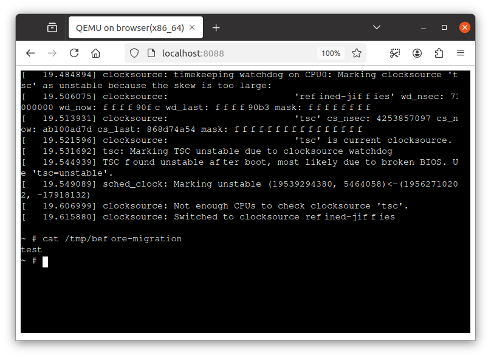

# Migrating VM state from host to the browser

QEMU supports migration of VM state.
This feature is still usable on QEMU Wasm.
This document describes how to utilize this on QEMU Wasm, for migrating VM state from host to the browser.

## Step 1: Taking a snapshot on the natvie QEMU

[Dockerfile](./Dockerfile) of this direcotry contains necessary dependencies to build and run (native) QEMU.
To build this container, run the following at the repository root directory.

```
$ docker build -f ./examples/emscripten-qemu-tcg/image/Dockerfile.qemu -t build-qemu-native ./examples/emscripten-qemu-tcg/image/
$ docker run --rm -d --name build-qemu-native -v $(pwd):/qemu/:ro build-qemu-native
$ docker exec -it build-qemu-native /qemu/configure --static --target-list=x86_64-softmmu --cross-prefix= \
    --without-default-features --enable-system --with-coroutine=ucontext --enable-virtfs --enable-attr
$ docker exec -it build-qemu-native make -j $(nproc) qemu-system-x86_64
$ docker exec -it build-qemu-native /bin/bash -c "cp /qemu/pc-bios/{bios-256k.bin,vgabios-stdvga.bin,kvmvapic.bin,linuxboot_dma.bin} /pack/"
```

The following starts the VM on QEMU.

```
$ docker exec -it build-qemu-native \
./qemu-system-x86_64 \
-nographic -m 512M -accel tcg,tb-size=500 \
-L /pack/ \
-nic none \
-drive if=virtio,format=raw,file=/pack/rootfs.bin \
-kernel /pack/bzImage \
-append "earlyprintk=ttyS0,115200n8 console=ttyS0,115200n8 root=/dev/vda rootwait ro loglevel=7"
```

In this VM, we create a file `/tmp/before-migration` with contents `test` to check if migration succeeded later.

```
# echo test > /tmp/before-migration
```

Start the QEMU monitor using `Ctrl-A C`.
On the monitor, you can take a snapshot of the VM using `migrate file:/pack/vm.state` command which saves the snapshot at `/pack/vm.state`.

```
(qemu) migrate file:/pack/vm.state
(qemu) quit
```

Now `/pack` directory in the `build-qemu-native` container contains VM images and the snaphsot.

## Step 2: Restarting the VM inside browser

To build QEMU Wasm, run the following at the repository root directory (they are same steps as written in [`../../README.md`](../../README.md)).

```console
$ docker build -t buildqemu - < Dockerfile
$ docker run --rm -d --name build-qemu-wasm -v $(pwd):/qemu/:ro buildqemu
$ EXTRA_CFLAGS="-O3 -g -Wno-error=unused-command-line-argument -matomics -mbulk-memory -DNDEBUG -DG_DISABLE_ASSERT -D_GNU_SOURCE -sASYNCIFY=1 -pthread -sPROXY_TO_PTHREAD=1 -sFORCE_FILESYSTEM -sALLOW_TABLE_GROWTH -sTOTAL_MEMORY=2300MB -sWASM_BIGINT -sMALLOC=mimalloc --js-library=/build/node_modules/xterm-pty/emscripten-pty.js -sEXPORT_ES6=1 -sASYNCIFY_IMPORTS=ffi_call_js" ; \
  docker exec -it build-qemu-wasm emconfigure /qemu/configure --static --target-list=x86_64-softmmu --cpu=wasm32 --cross-prefix= \
    --without-default-features --enable-system --with-coroutine=fiber --enable-virtfs \
    --extra-cflags="$EXTRA_CFLAGS" --extra-cxxflags="$EXTRA_CFLAGS" --extra-ldflags="-sEXPORTED_RUNTIME_METHODS=getTempRet0,setTempRet0,addFunction,removeFunction,TTY,FS" && \
  docker exec -it build-qemu-wasm emmake make -j $(nproc) qemu-system-x86_64
```

Then, you can copy the VM images and the snapshot created in the previous steps into QEMU Wasm as following.

```
$ docker cp build-qemu-native:/pack - | docker cp - build-qemu-wasm:/
```

Finally, package dependencies and run the server.

```
$ docker exec -it build-qemu-wasm /bin/sh -c "/emsdk/upstream/emscripten/tools/file_packager.py qemu-system-x86_64.data --preload /pack > load.js"
$ mkdir -p /tmp/test-js/htdocs/
$ cp -R ./examples/emscripten-qemu-tcg/src/* /tmp/test-js/
$ cp ./examples/migration/module.js /tmp/test-js/htdocs/
$ docker cp build-qemu-wasm:/build/qemu-system-x86_64 /tmp/test-js/htdocs/out.js
$ for f in qemu-system-x86_64.wasm qemu-system-x86_64.worker.js qemu-system-x86_64.data load.js ; do
    docker cp build-qemu-wasm:/build/${f} /tmp/test-js/htdocs/
  done
$ docker run --rm -p 127.0.0.1:8088:80 \
         -v "/tmp/test-js/htdocs:/usr/local/apache2/htdocs/:ro" \
         -v "/tmp/test-js/xterm-pty.conf:/usr/local/apache2/conf/extra/xterm-pty.conf:ro" \
         --entrypoint=/bin/sh httpd -c 'echo "Include conf/extra/xterm-pty.conf" >> /usr/local/apache2/conf/httpd.conf && httpd-foreground'
```

Then `localhost:8088` serves the page.

s

This VM is migrated from the native QEMU so you can skip Linux boot sequence and can also find `/tmp/before-migration` file created in the previous steps.

```
# cat /tmp/before-migration
test
```

