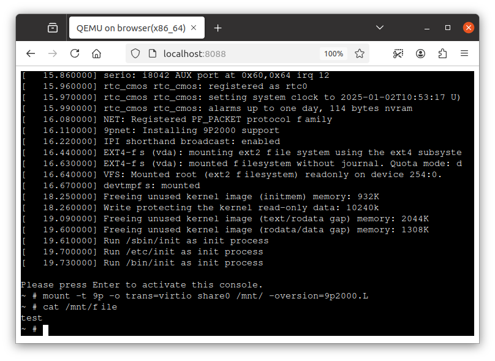

# Exposing files to the guest with virtfs

QEMU supports virtfs for sharing files from the host to the guest and that feature is still usable on QEMU Wasm.
This document describes how to utilize virtfs on QEMU Wasm.

You can use [`-virtfs`](https://www.qemu.org/docs/master/system/qemu-manpage.html) flag to enable virtfs, as shown in [`./module.js`](./module.js).
This enales to share files managed by [emscripten's filesystem](https://emscripten.org/docs/porting/files/file_systems_overview.html) (i.e. `FS` object) to the guest VM.
In the following flag, `/share` directory of emscripten's filesystem is shared to the guest with a mount tag `share0`.

```js
    '-virtfs', 'local,path=/share,mount_tag=share0,security_model=passthrough,id=share0',
```

You can also add files to emscripten's filesystem before QEMU Wasm starts.
[`./module.js`](./module.js) modifies `FS` by adding a file `/share/file` with the contents `test`.

```js
Module['preRun'].push((mod) => {
    mod.FS.mkdir('/share');
    mod.FS.writeFile('/share/file', 'test');
});
```

## Demo



After setting up a http server with x86_64 guest VM as shown in [README](../../README.md), you can put [`./module.js` of this directory](./module.js) to the server to enable virtfs.

```console
$ cp ./examples/virtfs/module.js /tmp/test-js/htdocs/
```

After starting the guest VM, you can mount the shared filesystem using the mount tag specified in the virtfs flag (`share0`).
The file shared from emscripten's filesystem is also accessible from the guest.

```console
$ mount -t 9p -o trans=virtio share0 /mnt/ -oversion=9p2000.L
$ cat /mnt/file
test
```
